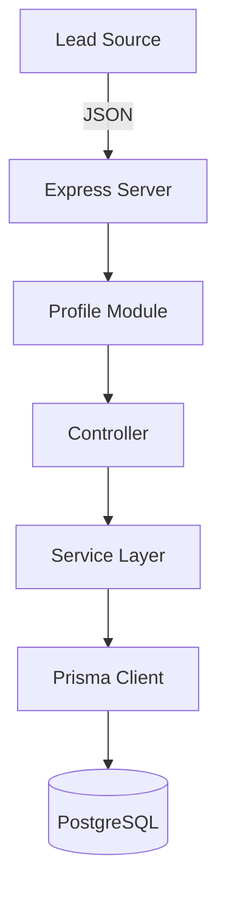

# Customer Profile Engine (Lead-Gen Analytics)

A modular Domain-Driven Design (DDD) engine built to transform raw lead data into qualified customer profiles. This application goes beyond basic CRUD by tracking mission-critical data points—such as Import Compliance (FSVP) and Logistics Maturity—to automate lead scoring and business intelligence.

## 🛠 Data Flow Architecture



## Getting Started

### 1. Clone and Install

```bash
git clone git@github.com:Hambonoire/customer-profile-engine.git
cd customer-profile-engine
npm install

```
