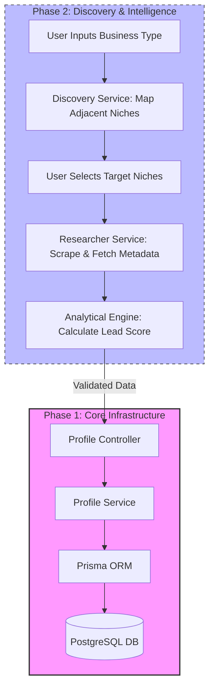

# Customer Profile Engine (Lead-Gen Analytics)

A modular Domain-Driven Design (DDD) engine built to transform raw lead data into qualified customer profiles. This application goes beyond basic CRUD by tracking mission-critical data points—such as Import Compliance (FSVP) and Logistics Maturity—to automate lead scoring and business intelligence.

## Data Flow Architecture



## Getting Started

### 1. Clone and Install

```bash
git clone git@github.com:Hambonoire/customer-profile-engine.git
cd customer-profile-engine
npm install

```

### 2. Environment Setup

Create a .env file in the root directory and add your local PostgreSQL connection string:
`DATABASE_URL="postgresql://YOUR_USERNAME@localhost:5432/customer_profile_db?schema=public"`

### 3. Database Migration

Initialize your local database and sync the Prisma schema:

`npx prisma migrate dev --name init_local_db`

### 4. Run the App

`node src/server.js`

The server will start at http://localhost:3000.
